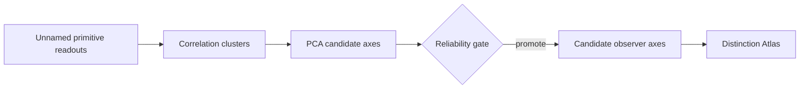

# Observer Discovery

## Can observer axes be discovered before the observer is named?

Observer Discovery starts from **unnamed primitive readouts**, groups redundant measurements, constructs candidate readout axes, and promotes only axes that pass a pre-specified distinguishability gate.

> **Public status:** controlled toy-world methods artifact. The frozen v0.4 results are the scientific source of truth; the executable code in this repository is a **curated reconstruction**, not a byte-identical recovery of the historical runner.



## Frozen v0.4 result

Under the historical default setting (`n_per_kernel=200`, `T=256`, stride `1`, seed `42`), the artifact used **13 primitive readouts**, discovered **4 candidate axes**, and promoted **2**. The strongest axis had effect size **4.099** and AUROC **0.9998**. Its stable readout signature concentrated on:

`autocorr_lag1 · rolling_vol_std · rolling_vol_mean · high_frequency_energy · max_drawdown_proxy · kurtosis_proxy · autocorr_lag5 · turning_rate`

The numerical axis label (`axis_3`) is not the scientific object; cluster labels can permute. The recurring **readout signature** is the object tracked across seeds.

## Reliability and interface checks

The frozen controls make the claim deliberately conditional:

- **Label shuffle:** top effect `0.115`, AUROC `0.5308`, **0 promoted axes**.
- **Volatility-family knockdown:** top effect `0.542`, **0 promoted axes**.
- **Stride 1 → 16:** top effect `4.099 → 0.237`; no axes promoted at strides 8 or 16.
- **Measurement noise 0 → 2.0:** top effect `4.099 → 0.621`; no promoted axes at the high-noise endpoint.
- **24-seed stability:** top axis promoted `24/24`; mean effect `3.902`; minimum effect `3.566`; mean AUROC `0.9995`; mean canonical-signature Jaccard `0.985`.

These checks support an **interface-dependent** statement: distinguishability belongs to the combination of generator, readout bank, and observation interface—not to the generator alone.

## What is executable here?

The exact historical `run_observer_discovery_v0.py` is listed in the archived v0.5 version manifest, together with its stability script and smoke tests, but that source file has not been recovered as a standalone canonical Library asset. `experiments/observer_discovery_reconstruction.py` is therefore a transparent release reconstruction of the method, not the historical source.

Run:

```bash
python -m venv .venv
source .venv/bin/activate  # Windows: .venv\Scripts\activate
pip install -r requirements.txt
python experiments/observer_discovery_reconstruction.py
python scripts/check_reconstruction.py
python scripts/validate_artifact.py
pytest -q
```

The reconstruction is qualified against **structural expectations**, not exact historical floating-point values: 13 readouts; candidate-axis construction; baseline distinguishability; label-shuffle collapse; readout-family specificity; and degradation under severe interface coarsening/noise. See [`REPRODUCIBILITY.md`](REPRODUCIBILITY.md).

## Handoff to Distinction Atlas

Observer Discovery ends at the handoff:

`primitive readouts → candidate axes → reliability gate → promoted axes → Distinction Atlas`

It changes the atlas from

`distinction × hand-specified observer → visibility`

to

`distinction × discovered/promoted candidate axis × interface → visibility`.

The repository does **not** include Observer Ecology, WDBW, or world-stabilization experiments as Observer Discovery results. See [`OGD_BRIDGE.md`](OGD_BRIDGE.md).

## Claim boundary

The supported claim is narrow:

> Under a specified toy generator and primitive readout bank, stable candidate observer axes can be discovered and stress-tested before the author assigns semantic observer names.

This repository does **not** claim to discover real observers, identify causal mechanisms, establish a universal observer basis, demonstrate empirical transfer, or validate WDBW. See [`CLAIM_BOUNDARY.md`](CLAIM_BOUNDARY.md).
